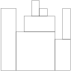

# StoneWall

The Java source code [here](StoneWall.java) presents the solution for [this](https://app.codility.com/programmers/lessons/7-stacks_and_queues/stone_wall/) challenge.

Requirements Description:

You are going to build a stone wall. The wall should be straight and N meters long, and its thickness should be constant; however, it should have different heights in different places. The height of the wall is specified by an array H of N positive integers. H[I] is the height of the wall from I to I+1 meters to the right of its left end. In particular, H[0] is the height of the wall's left end and H[N−1] is the height of the wall's right end.

The wall should be built of cuboid stone blocks (that is, all sides of such blocks are rectangular). Your task is to compute the minimum number of blocks needed to build the wall.

Write a function:

`class Solution { public int solution(int[] H); }`

that, given an array H of N positive integers specifying the height of the wall, returns the minimum number of blocks needed to build it.

For example, given array H containing N = 9 integers:

`H[0] = 8    H[1] = 8    H[2] = 5`

`H[3] = 7    H[4] = 9    H[5] = 8`

`H[6] = 7    H[7] = 4    H[8] = 8`

The function should return 7, as it follows in the layout below:

Strategy:

 - Loop through array elements, tracking previous positions in memory and:
   - if the last cached position is higher than the current one (descending):
     - while new position is less than the last cached entry, iteratively compare it with previous cached entries, until we find a position (previous block) lower or at the same level as it
   - after previous this processing, cache may be empty, or current cached entry is higher or equal to new high position
   - if it is higher, increment counter (new block) and add new position to cache
   - if it is equal, we have a plateau - continue analysis (no new block, and no need for a cache update)
